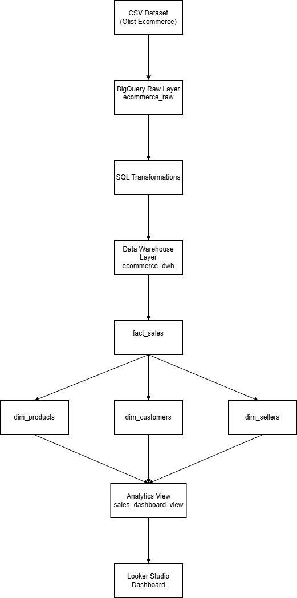
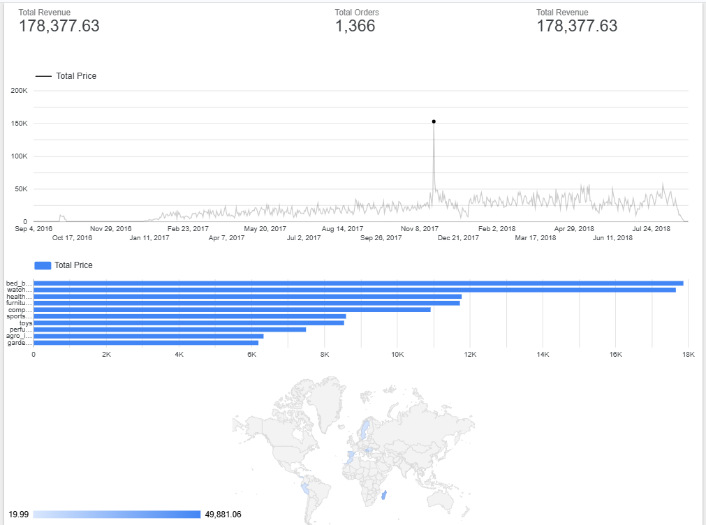

# BigQuery Ecommerce Data Warehouse

## Project Overview

This project implements a **cloud-based data warehouse using Google BigQuery** to analyze e-commerce sales data.

The system ingests raw CSV datasets, transforms them into a **star schema warehouse**, and visualizes insights using **Looker Studio dashboards**.

---

# Architecture

Pipeline Flow:

CSV Dataset → BigQuery Raw Tables → SQL Transformations → 
Star Schema Data Warehouse → Analytics View → Looker Studio Dashboard

The data pipeline follows this architecture:



## Data Pipeline

1. Raw CSV files are uploaded into BigQuery dataset `ecommerce_raw`.
2. SQL transformations clean and normalize the data.
3. A star schema data warehouse is created in `ecommerce_dwh`.
4. Fact and dimension tables support analytical queries.
5. An analytics view is created for BI dashboards.
6. Looker Studio connects to BigQuery for visualization.
---

# Technologies

- Google Cloud Platform
- BigQuery
- SQL
- Looker Studio

---

# Data Warehouse Model

### Fact Table
- `fact_sales`

### Dimension Tables
- `dim_customers`
- `dim_products`
- `dim_sellers`
- `dim_date`

---

# Dashboard Insights

The dashboard provides key business metrics:

- Total Revenue KPI
- Revenue Trend Over Time
- Top Product Categories
- Sales Distribution by Region

---

# Dashboard



---
## Example Analytics Query

Top product categories by revenue:

```sql
SELECT
p.category,
SUM(f.price) AS revenue
FROM ecommerce_dwh.fact_sales f
JOIN ecommerce_dwh.dim_products p
ON f.product_id = p.product_id
GROUP BY p.category
ORDER BY revenue DESC
LIMIT 10;
```
---
---
## Skills Demonstrated
```markdown
- Data Warehousing
- Star Schema Modeling
- SQL Transformations
- BigQuery
- Business Intelligence
- Data Visualization
```
---

# Dataset

Brazilian E-Commerce Public Dataset by Olist

Source:
https://www.kaggle.com/datasets/olistbr/brazilian-ecommerce
